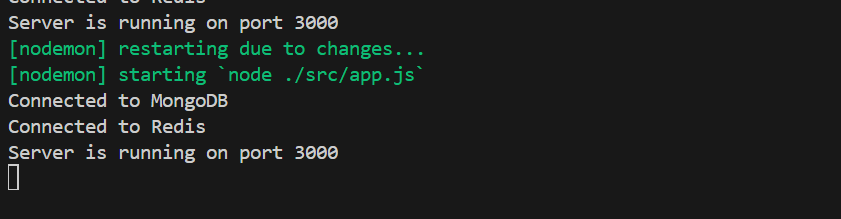
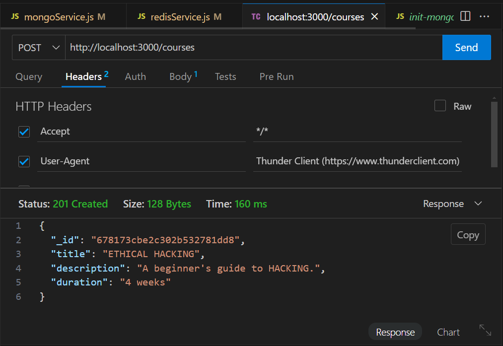
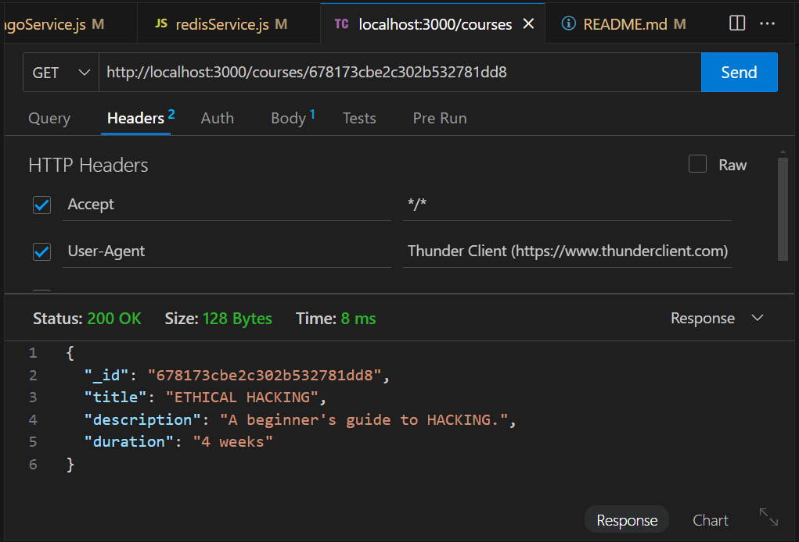
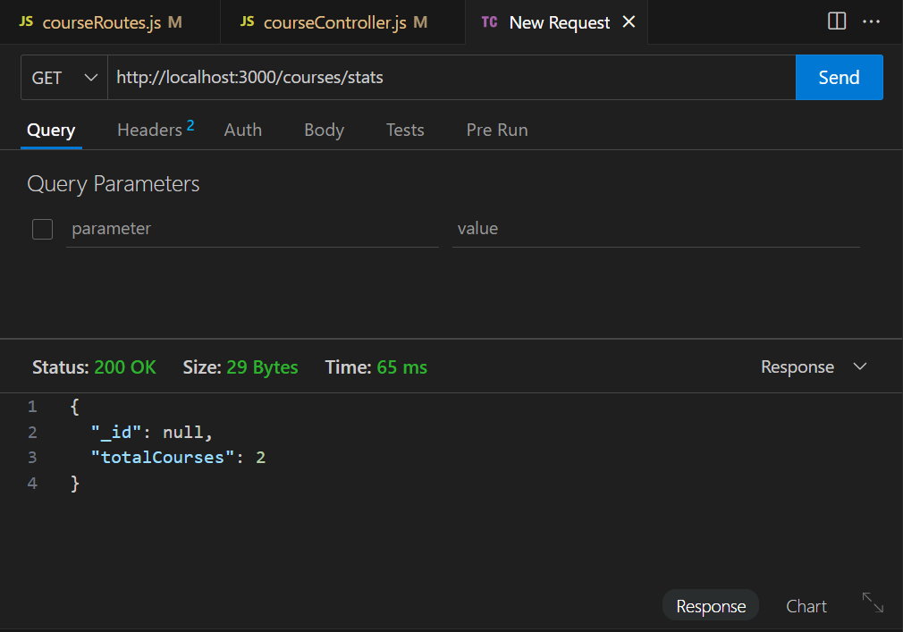

# Learning Platform Template

Ce projet est un modèle de plateforme d'apprentissage conçu pour démontrer l'utilisation de MongoDB et Redis dans une application Node.js. Il inclut des exemples de gestion des connexions aux bases de données, de mise en cache avec Redis, et de structuration d'une application Express avec des contrôleurs et des routes séparés. Ce modèle peut servir de point de départ pour développer des applications plus complexes.

## Prerequisites
- Install [Docker](https://www.docker.com/get-started) and [Docker Compose](https://docs.docker.com/compose/install/).
- Ensure the docker-compose.yml file exists in the root directory
- Start the containers:
  
   ```sh
   docker-compose up -d
  
## Installation et Lancement du Projet

1. **Cloner le dépôt**
     ```sh
     git clone <url-du-dépôt>
     cd learning-platform-template

2. **Configurer les variables d'environnement**
Modifiez le fichier .env à la racine du projet selon vos paramètres .

3. **Installer les dépendances** :
    ```sh
     npm install

4. **Démarrer l'application** :
    ```sh
     npm start

## Structure du Projet

```
src/
config/
   db.js : Gestion des connexions aux bases de données MongoDB et Redis.
   env.js : Validation et exportation des variables d'environnement.
controllers/
   courseController.js : Logique métier pour les opérations sur les cours.
routes/
   courseRoutes.js : Définition des routes pour les opérations sur les cours.
services/
   mongoService.js : Services pour les opérations MongoDB.
   redisService.js : Services pour les opérations Redis.
app.js : Point d'entrée de l'application.
```

## Choix Techniques

- **Séparation des modules** : La création de modules séparés pour les connexions aux bases de données permet la centralisation des données de connexion, facilitant ainsi leur réutilisation et la gestion des changements.
- **Validation des variables d'environnement** : Valider les variables d'environnement au démarrage est crucial pour s'assurer que l'application dispose de toutes les informations nécessaires pour fonctionner correctement.
- **Utilisation de services** : Créer des services séparés permet de réutiliser la logique métier, d'améliorer la modularité et de faciliter les tests unitaires.
- **Gestion du cache avec Redis** : Utiliser des TTL pour les entrées de cache, invalider les caches obsolètes et structurer les données pour un accès rapide.

## Réponses aux Questions

### db.js

- **Pourquoi créer un module séparé pour les connexions aux bases de données ?**
   La création d'un module séparé permet la centralisation des données de connexion, ce qui permet sa réutilisabilité au lieu de dupliquer le code. Ainsi, les changements seront faciles et ils ne vont pas affecter tout le code.

- **Comment gérer proprement la fermeture des connexions ?**
   On peut configurer un délai de réponse, si dépassé sans aucune action, on ferme la base de données. De plus, on peut ajouter le bloc `finally` pour `try/catch` pour fermer la base de données toujours même en cas d'erreurs.

### env.js

- **Pourquoi est-il important de valider les variables d'environnement au démarrage ?**
   Car ces variables sont nécessaires au bon fonctionnement de l'application. Elles contiennent les informations de connexion, les clés API, etc.

- **Que se passe-t-il si une variable requise est manquante ?**
   Elle va affecter les services et fonctionnalités offerts par l'application. Par exemple, si les variables de connexion à la base de données manquent, il n'y aura pas d'accès.

### .env

- **Quelles sont les informations sensibles à ne jamais commiter ?**
   Les informations sensibles à ne jamais commiter incluent les clés API, les mots de passe, les informations de connexion à la base de données, les secrets JWT, et toute autre information confidentielle qui pourrait compromettre la sécurité de l'application si elle était exposée.

- **Pourquoi utiliser des variables d'environnement ?**
   Les variables d'environnement permettent de séparer la configuration du code. Elles permettent également de sécuriser les informations sensibles en les stockant en dehors du code source.

### courseController.js

- **Quelle est la différence entre un contrôleur et une route ?**
   Une route définit les points d'entrée de l'API, un contrôleur gère la logique métier.

- **Pourquoi séparer la logique métier des routes ?**
   Pour une meilleure organisation, maintenabilité et testabilité du code.

### route.js

- **Pourquoi séparer les routes dans différents fichiers ?**
   Pour améliorer la lisibilité, la maintenabilité et faciliter la gestion des différentes parties de l'application.

- **Comment organiser les routes de manière cohérente ?**
   Grouper les routes par fonctionnalité ou ressource, utiliser des noms de fichiers descriptifs et suivre une structure de dossiers logique.

### mongoService.js

- **Pourquoi créer des services séparés ?**
   Pour réutiliser la logique métier, améliorer la modularité et faciliter les tests unitaires.

### redisService.js

- **Comment gérer efficacement le cache avec Redis ?**
   Utiliser des TTL (Time-To-Live) pour les entrées de cache, invalider les caches obsolètes et structurer les données pour un accès rapide.

- **Quelles sont les bonnes pratiques pour les clés Redis ?**
   Utiliser des noms de clés descriptifs et hiérarchiques, éviter les clés trop longues, et utiliser des préfixes pour grouper les clés par fonctionnalité.

### app.js

- **Comment organiser le point d'entrée de l'application ?**
   Importer les configurations et les services nécessaires, initialiser les connexions aux bases de données, configurer les middlewares, monter les routes, et démarrer le serveur.

- **Quelle est la meilleure façon de gérer le démarrage de l'application ?**
   Utiliser une fonction asynchrone pour gérer les connexions aux services externes, gérer les erreurs de démarrage, et s'assurer que toutes les dépendances sont prêtes avant de démarrer le serveur.

## Résultats des Requêtes

*Description*: L'application lancée en port 3000.

<div align="center">

</div>

*Description*: Le résultat de la requete "POST" pour a création d'un cours .

<div align="center">

</div>

*Description*: Le résultat de la requete "GET" pour a chercher un cours via son id .

<div align="center">

</div>

*Description*: Le résultat de la requete "GET" pour a renvoyer tous les cours .

<div align="center">

</div>


## Auteur

Ce travail a été réalisé par Ibtissam Benabid .
